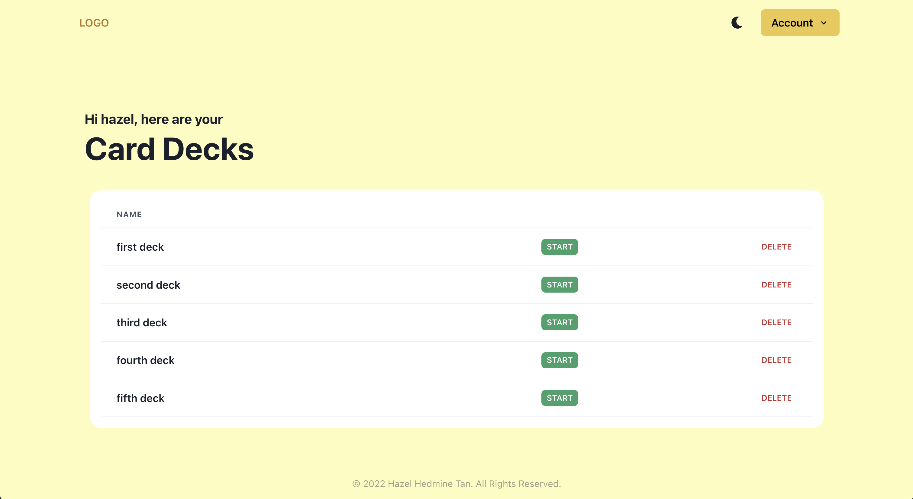

# Elememory

A web application that lets you make and store flash cards. This repository holds the frontend component of the application.

Backend Repository Link: [here](https://github.com/hazelhedmine/elememory-backend)  
Web Application Link: _\<to be added>_

> This project is still currently in development but the README will be updated with the project link as soon as the MVP is live.

This project was bootstrapped with [Create React App](https://github.com/facebook/create-react-app).

## Table of Contents

- [Features](#features)
  - [User Service](#user-service)
  - [Card Service](#card-service)
- [2. Available Scripts](#available-scripts)

## Features

The frontend was built using React JS with Chakra UI. Light mode and dark mode is supported as shown in the following section.

### User Service

User administration was implemented to allow the user to store their cards and decks.

#### Landing Page - Light Mode

#### Landing Page - Dark Mode

#### Sign Up Page

#### Login Page

#### User Profile Page

This page is only accessible once logged in.

### Card Service

#### Home Page

Once the user successfully logs in, they will get a view of all their decks.

#### Deck Page

TODO: currently in the process of implementing.

## Available Scripts

In the project directory, you can run:

### `npm start`

Runs the app in the development mode. 
Open [http://localhost:3000](http://localhost:3000) to view it in the browser.

The page will reload if you make edits. 
You will also see any lint errors in the console.

### `npm run test`

Launches the test runner for unit tests using Jest. Unit testing was done for individual components. 

### `npm run cypress:open`

Launches cypress for E2E testing. 

### `npm run eslint`

Launches the linter and prints any lint errors in the console. 

### `npm run build`

Builds the app for production to the `build` folder. 
It correctly bundles React in production mode and optimizes the build for the best performance.

The build is minified and the filenames include the hashes. 
Your app is ready to be deployed!
